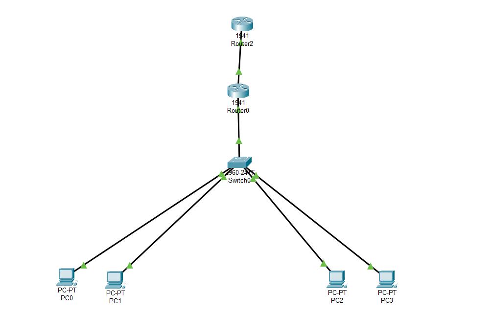

# Network Engineering
# 📡 Lab Cisco Packet Tracer : VLAN + DHCP + NAT + Internet simulé

## 🎯 Objectif

Ce laboratoire simule un petit réseau d’entreprise avec :
- Des VLANs pour la segmentation
- Un serveur DHCP intégré au routeur
- Un accès Internet via NAT overload (PAT)
- Un second routeur simulant Internet (203.0.113.2)

---

## 🧱 Topologie du réseau

---

## ⚙️ Configurations principales

### 🔹 VLANs
- VLAN 10 – Administration (192.168.10.0/24)
- VLAN 20 – Étudiants (192.168.20.0/24)

### 🔹 DHCP (sur Router0)
- Attribution dynamique d’adresses IP par VLAN
- DNS + passerelle envoyés aux clients

### 🔹 NAT Overload (PAT)
- NAT configuré sur l’interface sortante vers le routeur Internet
- ACL utilisée pour identifier le trafic à traduire

### 🔹 Trunk et sous-interfaces
- `fa0/0.10` → 192.168.10.1 (VLAN 10)
- `fa0/0.20` → 192.168.20.1 (VLAN 20)

---

## 🧪 Tests de validation

- ✅ Les PC reçoivent une adresse IP automatique par DHCP
- ✅ Le ping entre les VLANs fonctionne
- ✅ Le ping vers l’adresse publique 203.0.113.2 réussit
- ✅ La traduction NAT est visible avec `show ip nat translations`

---

## 📂 Fichiers inclus

| Fichier              | Description                                      |
|----------------------|--------------------------------------------------|
| `vlan-dhcp-nat.pkt`  | Fichier Packet Tracer complet du lab             |
| `README.md`          | Ce document d’explication et de résumé du lab    |

---

## 👨‍🎓 Auteur

**Ismael Baby**  
Étudiant en cybersécurité – CCNB Campus de Dieppe  
GitHub : [@ismael-cybersec](https://github.com/ismael-cybersec)
