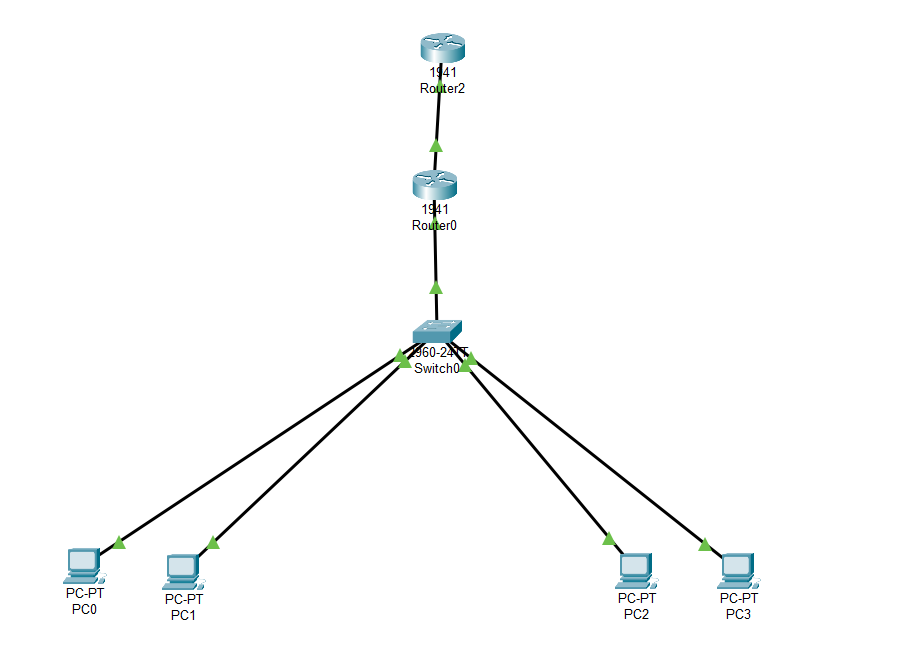

# 📡 Lab Cisco Packet Tracer : Création d’un réseau avec VLAN, DHCP, NAT et accès Internet simulé

## 🎯 Objectif du lab

Ce laboratoire a pour but d’apprendre à configurer un réseau d'entreprise structuré avec :
- **VLANs** pour segmenter le réseau local (meilleure sécurité et organisation)
- **DHCP** pour attribuer automatiquement des adresses IP aux PC
- **NAT Overload (PAT)** pour permettre aux PC d’accéder à Internet à partir d’adresses privées
- Un **deuxième routeur** jouant le rôle d’un fournisseur Internet (adresse 203.0.113.2)

Ce lab est idéal pour comprendre **les bases de la segmentation réseau, de l'adressage dynamique et du routage vers Internet**.

---

## 🧱 Topologie du réseau



### Équipements :
- 1 Switch
- 2 Routeurs (Router0 = réseau interne, Router1 = Internet simulé)
- 4 PC clients (2 dans chaque VLAN)

### Plan d’adressage :

| Appareil | VLAN | IP (via DHCP) | Rôle |
|----------|------|---------------|------|
| PC0      | 10   | 192.168.10.x  | Administration |
| PC1      | 10   | 192.168.10.x  | Administration |
| PC2      | 20   | 192.168.20.x  | Étudiant |
| PC3      | 20   | 192.168.20.x  | Étudiant |
| Router0 (fa0/0.10) | 10 | 192.168.10.1 | Passerelle VLAN 10 |
| Router0 (fa0/0.20) | 20 | 192.168.20.1 | Passerelle VLAN 20 |
| Router0 (fa0/1) | - | 203.0.113.1 | NAT (sortie Internet) |
| Router1 | - | 203.0.113.2 | Fournisseur Internet |

---

## ⚙️ Étapes de configuration (résumé)

### 1. Création des VLANs sur le switch
```bash
Switch(config)# vlan 10
Switch(config-vlan)# name Admin
Switch(config)# vlan 20
Switch(config-vlan)# name Etudiants
```
### 2. Attribution des ports aux VLANs
```bash
Switch(config)# interface range fa0/1 - 2
Switch(config-if-range)# switchport mode access
Switch(config-if-range)# switchport access vlan 10

Switch(config)# interface range fa0/3 - 4
Switch(config-if-range)# switchport mode access
Switch(config-if-range)# switchport access vlan 20
```
### 3. Configuration du Trunk vers Router0
```bash
Switch(config)# interface fa0/5
Switch(config-if)# switchport mode trunk
```
### Configuration du routeur interne (Router0)
### 1. Sous-interfaces VLAN (inter-VLAN routing)
```bash 
interface fa0/0.10
 encapsulation dot1Q 10
 ip address 192.168.10.1 255.255.255.0

interface fa0/0.20
 encapsulation dot1Q 20
 ip address 192.168.20.1 255.255.255.0
```
### 2. DHCP pour chaque VLAN
```bash
ip dhcp pool VLAN10
 network 192.168.10.0 255.255.255.0
 default-router 192.168.10.1
 dns-server 8.8.8.8

ip dhcp pool VLAN20
 network 192.168.20.0 255.255.255.0
 default-router 192.168.20.1
 dns-server 8.8.8.8

ip dhcp excluded-address 192.168.10.1 192.168.10.10
ip dhcp excluded-address 192.168.20.1 192.168.20.10
```
### Configuration NAT (PAT)
### 1. Configuration de l’interface NAT publique
```bash
interface fa0/1
 ip address 203.0.113.1 255.255.255.0
 ip nat outside
```
### 2. Définir les interfaces NAT internes
```bash
interface fa0/0.10
 ip nat inside
interface fa0/0.20
 ip nat inside
```
### 3. Configuration d’une ACL pour NAT
```bash
access-list 1 permit 192.168.10.0 0.0.0.255
access-list 1 permit 192.168.20.0 0.0.0.255
```
### 4. Appliquer NAT Overload
```bash
ip nat inside source list 1 interface fa0/1 overload
```

🧪 Tests à réaliser
✅ Vérifier que chaque PC a bien une IP via DHCP
✅ Tester la communication entre VLANs (ping entre PC0 et PC2)
✅ Faire un ping vers 203.0.113.2 pour simuler Internet
✅ Sur Router0, taper :

```bash
show ip nat translations
```
pour voir la traduction d’adresses

---

## 📂 Fichiers inclus

| Fichier              | Description                                      |
|----------------------|--------------------------------------------------|
| `vlan-dhcp-nat.pkt`  | Fichier Packet Tracer complet du lab             |
| `README.md`          | Ce document d’explication et de résumé du lab    |


## 👨‍🎓 Auteur

**Ismael Baby**  
Étudiant en cybersécurité – CCNB Campus de Dieppe  
GitHub : [@ismael-cybersec](https://github.com/ismael-cybersec)